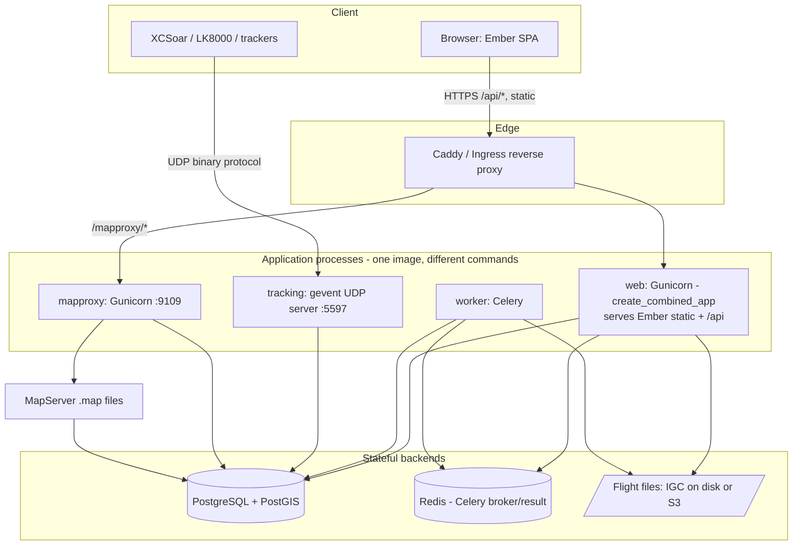
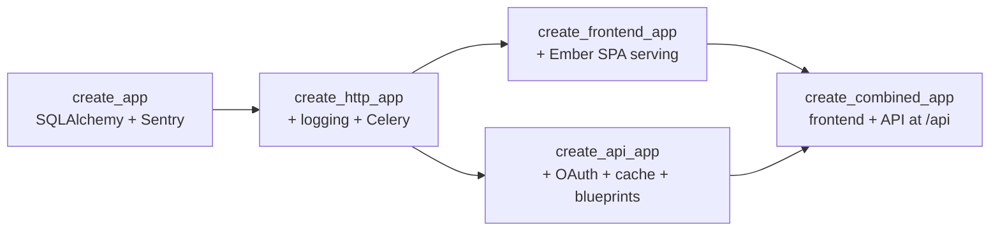
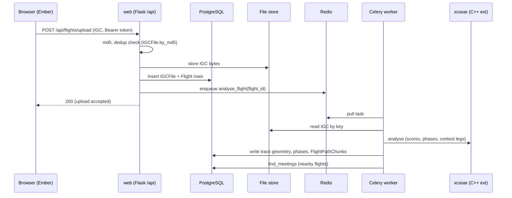
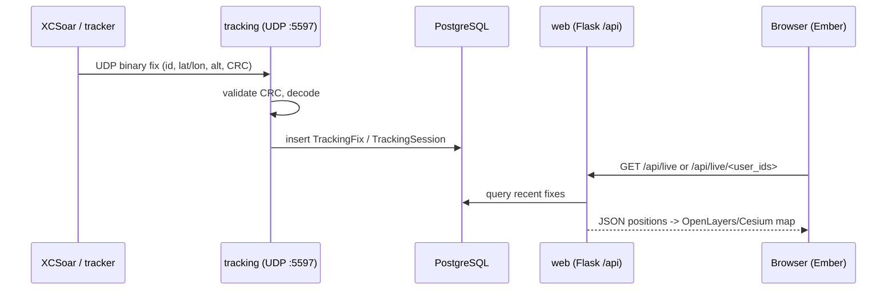

# SkyLines Architecture

This document gives a high-level overview of how SkyLines is structured and how
data flows through the system. It answers the "draw and share the architecture
and working flow" request from
[issue #2484](https://github.com/skylines-project/skylines/issues/2484).

SkyLines is an open-source web platform for soaring/gliding pilots to share
flights, view rankings, and use live GPS tracking. Production runs at
<https://skylines.aero>.

## Tech stack

| Layer | Technology |
| --- | --- |
| Frontend | Ember.js 3.24 (Glimmer components), Bootstrap 3, OpenLayers 5 (2D), Cesium (3D) |
| Auth | OAuth 2 password grant (`ember-simple-auth` ↔ `flask-oauthlib`), Bearer tokens |
| API | Flask 1.1, 17 resource blueprints, `webargs`/voluptuous request validation |
| ORM / DB | SQLAlchemy + GeoAlchemy2 on PostgreSQL 10 + PostGIS 2.5, Alembic migrations |
| Async tasks | Celery 3 with Redis as broker + result backend |
| Live tracking | gevent UDP server speaking the XCSoar binary protocol (port 5597) |
| Flight analysis | `xcsoar` C++ Python extension (scoring, phases, contest legs) |
| Maps | MapProxy (tile cache/WSGI) in front of MapServer `.map` files |
| File storage | IGC logs on disk (`SKYLINES_FILES_PATH`), keyed by `IGCFile.filename` |

## System architecture

One Docker image runs as several processes, each started with a different
command. Stateful backends (Postgres, Redis, file storage) are shared.



## App-factory layering

The Flask application is composed in layers in `skylines/app.py`. The frontend
and API are separate WSGI apps combined via `DispatcherMiddleware`, with the API
mounted at `/api`.



The browser talks almost exclusively to the JSON API under `/api`. There is
**no Ember Data** — routes and components call `this.ajax.request('/api/...')`
and parse plain JSON. Side channels that do *not* go through the REST API are
map tiles (`/mapproxy`), the live-tracking UDP ingress, and the LiveTrack24
compatibility endpoints.

## Working flow 1 — flight upload & analysis



## Working flow 2 — live tracking



## Codebase map

```
skylines/            # Main Python package
├── app.py           # Flask app factory (create_app, create_api_app, ...)
├── database.py      # Flask-SQLAlchemy db instance
├── model/           # ORM models (User, Flight, Club, Airport, TrackingFix, ...)
├── api/             # REST API
│   ├── views/       # Flask blueprints — 17 resource modules
│   ├── oauth.py     # OAuth 2 provider (access/refresh tokens)
│   └── cache.py     # Flask-Caching
├── frontend/views/  # Serves built Ember SPA + static files + LiveTrack24
├── lib/             # Utilities (geo, IGC parsing, xcsoar analysis, SQL helpers)
├── schemas/         # Request validation (voluptuous/webargs)
├── worker/          # Celery tasks (analyse_flight, find_meetings, upload_to_weglide)
├── tracking/        # UDP tracking server (gevent DatagramServer)
└── commands/        # CLI subcommands for manage.py

ember/               # Ember.js frontend SPA
config/              # Python app config (default.py, testing.py, docker.py)
migrations/          # Alembic migration versions
mapproxy/            # MapProxy config (mapproxy.yaml)
mapserver/           # MapServer map files (airspace, airports, MWP)
```

## Deployment (processes)

Production requires four long-running processes plus a migration step:

| Process | Command | Protocol | Notes |
| --- | --- | --- | --- |
| `web` | Gunicorn `wsgi_skylines:application` | HTTP | Ember static + `/api` in one app |
| `worker` | `manage.py celery runworker` | — (Redis) | Flight analysis, meetings, WeGlide |
| `tracking` | `manage.py tracking runserver` | UDP 5597 | XCSoar live fixes |
| `mapproxy` | Gunicorn `wsgi_mapproxy:application` | HTTP 9109 | Tiles/WMS in front of MapServer |
| `migrate` | `manage.py migrate upgrade` | — | One-shot before the others start |

Docker Compose (`docker-compose.yml`) orchestrates all of them together with
PostGIS, Redis, and Caddy as the reverse proxy.
